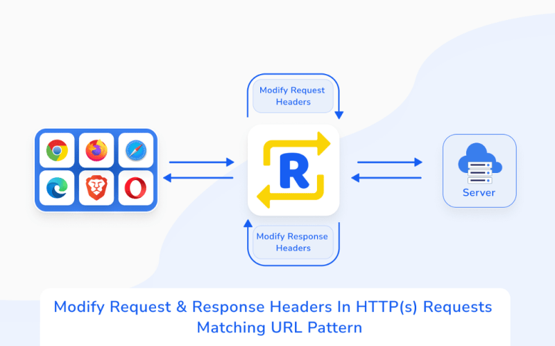
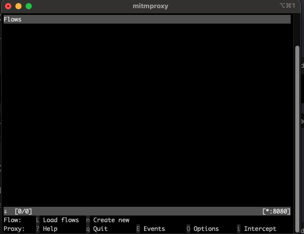
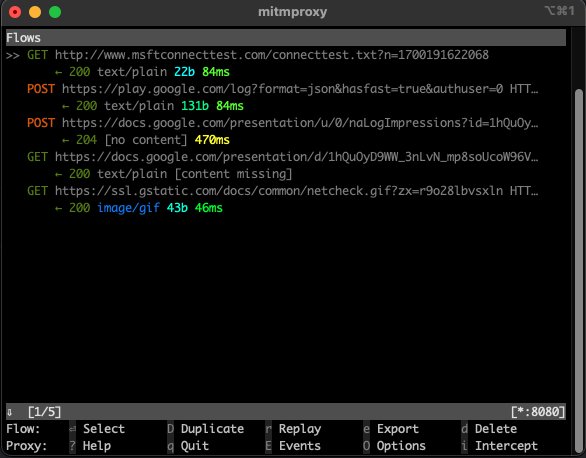
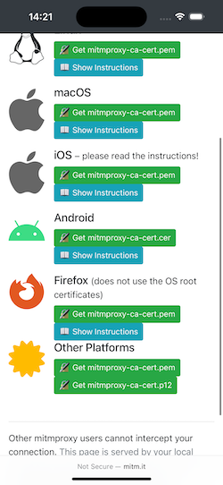
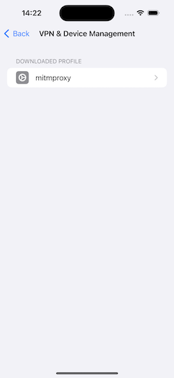
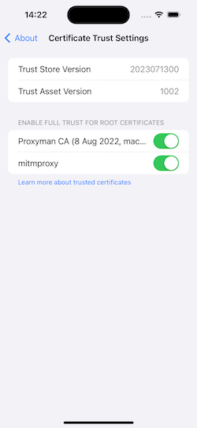
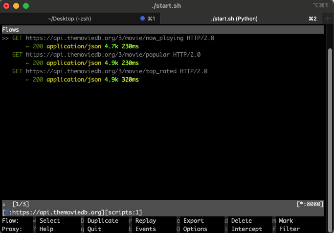
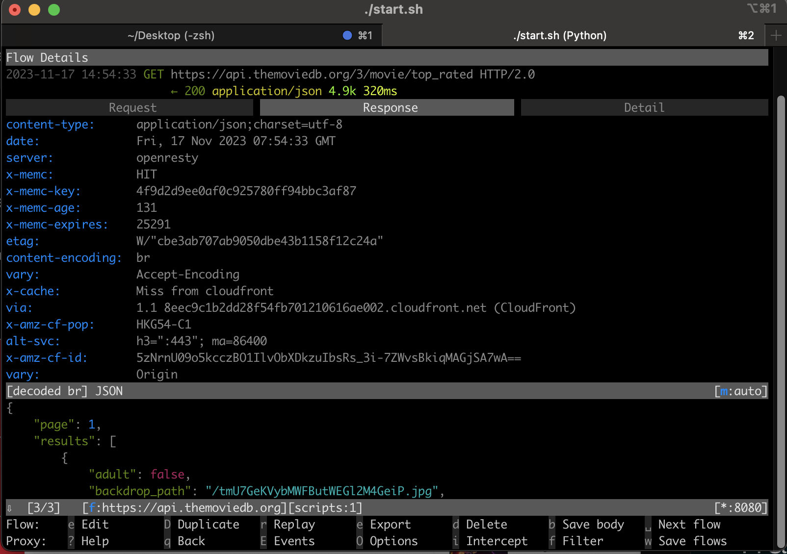
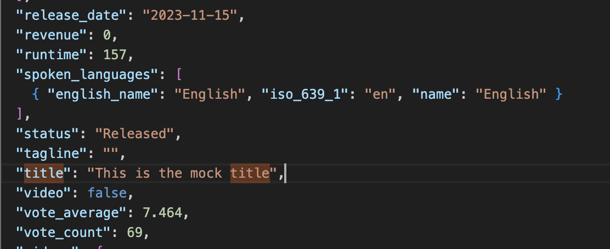

# Mock API Response with mitmproxy



When I work at Zen8labs as mobile developer, I need to mock API responses has become increasingly crucial for efficient testing and development workflows. While various tools offer powerful capabilities for intercepting and modifying HTTP traffic, they often come with a hefty price tag. This is where mitmproxy steps in as a cost-effective and feature-rich alternative.

## Why [mitmproxy](https://mitmproxy.org/)?

### The limitaions of Other Tools In Free License

[ProxyMan](https://proxyman.io/), while a powerful tool, faces limitations when it comes to mocking multiple requests simultaneously. This constraint can hinder developers who require the ability to mock various API responses concurrently.

On the other hand, [Charles](https://www.charlesproxy.com/), despite its robust features, imposes time restrictions in its free version. This limitation can be a roadblock for developers who need extended periods for testing and development without incurring additional costs.

### Why mitmproxy?

Choosing the right tool for intercepting and mocking API responses is essential, especially when budget constraints or functionality restrictions come into play. mitmproxy stands out by offering a balance between powerful features and a cost-effective solution.

### Key Advantages of mitmproxy:
1. **Cost-Effective**: Mitmproxy is open-source, ensuring that developers can harness its capabilities without the financial burden associated with premium alternatives.
2. **Multiple Request Mocking**: Unlike some tools that limit the ability to mock multiple requests simultaneously, mitmproxy excels in providing flexibility for diverse testing scenarios.
3. **No Time Restrictions**: Developers using mitmproxy won't encounter time constraints in the free version, allowing for extensive testing and development without interruptions.

## Start Using mitmproxy

### 1. Installation

Begin by installing mitmproxy on your machine. Open your terminal or command prompt and run:

 ```shell
 pip install mitmproxy
 ```

This will install mitmproxy along with its dependencies.
 
### 2. Start mitmproxy

Once the installation is complete, you can start mitmproxy by running the following command:

```shell
mitmproxy
``` 

This will launch the mitmproxy interactive console, and you'll start seeing captured requests and responses.



### 3. Configure Proxy Settings on Your Macbook

1. Open the "System Preferences" on your Macbook.
2. Go to "Network."
3. Select your connected Wi-Fi network on the left.
4. Click on the "Advanced..." button.
5. Go to the "Proxies" tab.
6. Check the box next to "Web Proxy (HTTP)".
7. In the "Web Proxy Server" field, enter the IP address of your Macbook and set the port to "8080".
8. Check the box next to "Secure Web Proxy (HTTPS)".
9. In the "Secure Web Proxy Server" field, enter the IP address of your Macbook and set the port to "8080".
10. Click "OK" to save the changes.

After this step, you can see requests is showing in mitmproxy UI like this:



### 4. View https requests in iOS Simulator

I have an iOS application using [TMDP API](https://developer.themoviedb.org/reference/intro/getting-started) which looks like this:

[](ios-app.png)

Now, I want to view HTTP requests in mitmproxy. The next step is to install the certificate on the simulator:

1. Open the Safari browser in the iOS Simulator.
2. Visit the mitm.it page and dowload certificate
3. Install and trust this certificate.

[](certificates.png)
[](install.png)
[](install.png)

Now, open the application to trigger an API call, and the requests will be displayed in mitmproxy:

[](requests.png)

[](requests.png)

## Modifying Responses based on JSON Configuration

```mitmproxy``` provides a powerful API that allows you to create addons to intercept, analyze, and modify both requests and responses in real-time. This flexibility enables you to customize the behavior of mitmproxy to suit your specific testing or development needs. In this section, we'll explore how to create a simple mitmproxy addon to modify requests and responses.

### 1. Addon Structure:

Update the structure of the addon to read the JSON configuration file:

```python
import json
from mitmproxy import http

class ModifyAddon:
    def __init__(self, config_path="modify_config.json"):
        with open(config_path, "r") as config_file:
            self.config = json.load(config_file)

    def request(self, flow: http.HTTPFlow):
        # Modify request logic goes here

    def response(self, flow: http.HTTPFlow):
        # Modify response logic goes here

```

### 2. Modify Response Based on Configuration:

Modify the response method to apply modifications based on the configuration:

```python
def response(self, flow: http.HTTPFlow):
    for rule in self.config:
        if (
            flow.request.method == rule["method"] and
            flow.request.pretty_url == rule["url"]
        ):
            with open(rule["local_file"], "r") as local_file:
                modified_content = local_file.read()
            flow.response.content = modified_content.encode("utf-8")
```

### 3. Example Configuration File (modify_config.json):

Create a JSON configuration file specifying rules for response modifications:

```python
[
  {
    "method": "GET",
    "url": "https://api/example",
    "local_file": "example.json"
  },
  {
    "method": "POST",
    "url": "https://api/example",
    "local_file": "example.json"
  }
]
```

### 4. Verify the Response

Let open my movie app and click to `The Hunger Games: The Ballad of Songbirds & Snakes` movie, this screen looks like that:

[](movie-detail-1.png)

Next, I created a configuration file like this:

```
{
    "method": "GET",
    "url": "https://api.themoviedb.org/3/movie/695721?append_to_response=videos,credits,reviews",
    "local_file": "movie-detail.json"
  } 
```

I then modified the title of the movie in the movie-detail.json file:



Let's open the app again and check:

[](movie-detail-2.png)

Great, the title has been changed!

This is the [source code](https://github.com/quanzen8labs/mitm-proxy-map-local-addons)


## Conclusion

As we wrap up our journey through the intricacies of intercepting and modifying API responses, remember that effective testing and development require adaptability. The ability to simulate various scenarios empowers you to create robust and resilient applications.


Happy coding, and may your API responses always be just what you need!


